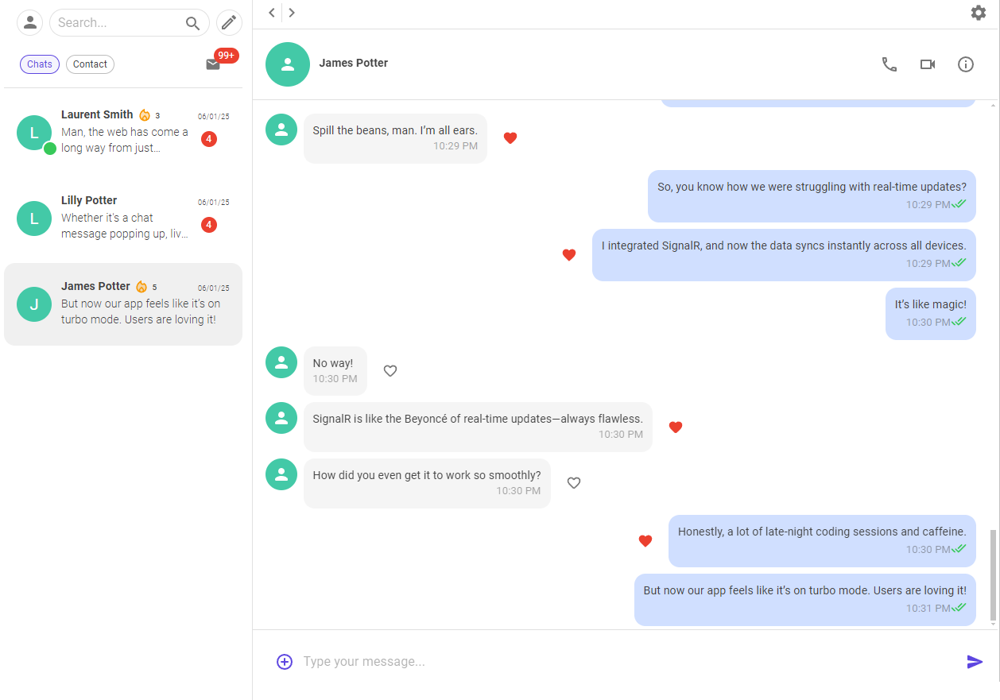

# SignalMe

# 🚀 Real-Time Chat Application



> Experience a modern, intuitive interface powered by MudBlazor components. The clean design ensures seamless navigation and optimal user experience across all devices.

## 🌟 Overview
Experience enterprise-grade real-time communications powered by ASP.NET Core SignalR with WebSocket transport. This sophisticated chat platform built with ASP.NET Core 8 and MudBlazor demonstrates high-performance real-time capabilities while combining the most engaging features from Viber and Snapchat. Watch as messages and reactions flow instantly between users through SignalR's robust real-time infrastructure.
## Server-side Implementation
- First, install the required NuGet package in the Client project:
  
  ``` dotnet add package Microsoft.AspNetCore.SignalR.Client

- Server-Side Implementation:

```csharp
using Microsoft.AspNetCore.SignalR;

public class ChatHub : Hub
{
    // Hub methods will be implemented here
    // This class handles real-time communication between clients
}
```
- Configure SignalR in the Server's Program.cs:
```csharp
// Add SignalR services
builder.Services.AddSignalR();

// Map the ChatHub to a specific endpoint
app.MapHub<ChatHub>("/chathub");
```
## Client-Side Implementation:
- In your Blazor components, add the SignalR client namespace:
```csharp
@using Microsoft.AspNetCore.SignalR.Client
@inject NavigationManager Navigation
```
## ✨ Key Features

### Real-Time Communication
- **Instant Messaging** - Messages appear instantly in your friend's chat 
- **Live Read Status** - See when your messages are read in real-time  
- **Dynamic Message Updates** - Like messages and see reactions instantly   

### Social Features
- **User Search** - Find and connect with friends via email search   
- **Streak System** - Track consecutive days of chatting with friends (Snapchat-style) 
- **Unread Messages Counter** - Stay updated with unread message counts in chat list 

## 🛠️ Technical Stack
- **Backend**: ASP.NET Core 8
- **Frontend**: MudBlazor Server Client App
- **Real-Time Communication**: SignalR WebSockets
- **UI Framework**: MudBlazor Components

## 🎯 Technical Highlights

### WebSocket Implementation
The application leverages SignalR's WebSocket technology to enable:
- Bi-directional real-time communication
- Instant message delivery
- Live status updates
- Real-time notification system

### User Experience
- Clean and intuitive interface using MudBlazor components
- Responsive design for all devices
- Seamless real-time updates without page refreshes

### Security
- Immediate email verification system for user connections
- Secure WebSocket connections
- 
## 🔍 Why This Project?
This project demonstrates my expertise in:
- Building scalable real-time applications
- Implementing modern web technologies
- Creating engaging user experiences
- Understanding complex system architectures
- Utilizing WebSocket technology effectively

## 🎨 UI/UX Features
- Modern and clean interface
- Intuitive navigation
- Real-time interaction feedback
- Responsive design
- User-friendly notifications

## 🚀 Future Enhancements
- Voice and video calls
- File sharing capabilities
- Group chat functionality
- End-to-end encryption
- Custom themes and personalization

## 📫 Contact
Feel free to reach out for any questions or collaboration opportunities!

sugamsingh377@gmail.com

*This project was developed with ❤️ using ASP.NET Core 8 and MudBlazor*
